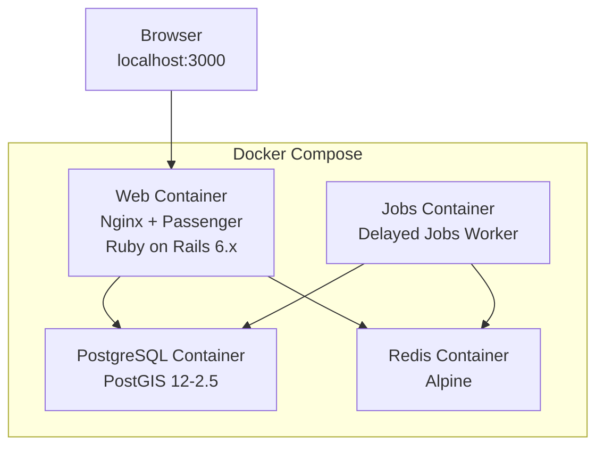
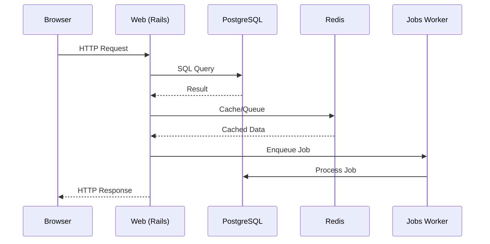
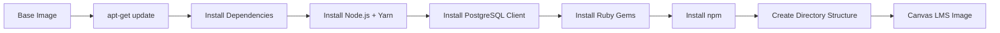
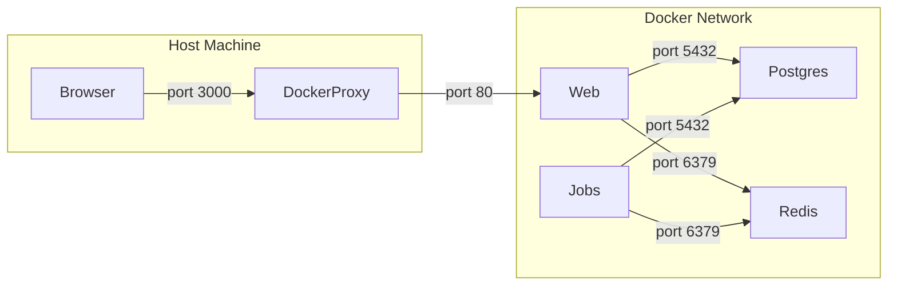

# Canvas LMS Architecture Documentation

## System Overview

Canvas LMS is a Ruby on Rails-based Learning Management System deployed using Docker containers.

## Container Architecture



## Service Details

### Web Service (canvas-lms-web)

| Property | Value |
|----------|-------|
| Base Image | instructure/ruby-passenger:2.7 |
| OS | Ubuntu 20.04 (Focal) |
| Ruby | 2.7 |
| Rails | 6.x |
| Web Server | Nginx + Phusion Passenger |
| Node.js | 14 |
| Yarn | 1.19.1 |
| Bundler | 2.2.17 |
| Port Mapping | 3000:80 |

### Jobs Service (canvas-lms-jobs)

| Property | Value |
|----------|-------|
| Same Image | Built from same Dockerfile as web |
| Purpose | Background/delayed job processing |
| Command | script/delayed_job run |

### PostgreSQL Service (canvas-lms-postgres)

| Property | Value |
|----------|-------|
| Base Image | postgis/postgis:12-2.5 |
| OS | Debian Buster (archived) |
| PostgreSQL | 12 |
| PostGIS | 2.5 |
| Port | 5432 |

### Redis Service (redis)

| Property | Value |
|----------|-------|
| Base Image | redis:alpine |
| Purpose | Caching, session storage, message queue |
| Port | 6379 |

## Data Flow



## Build Pipeline



## Network Topology



## Volume Mounts

| Host Path | Container Path | Purpose |
|-----------|---------------|---------|
| ./ (project root) | /usr/src/app | Source code for development |
| Docker named volume | /var/lib/postgresql/data | Database persistence |

## Known Build Issues and Fixes

### 1. Phusion Passenger GPG Key Expired

The key `D870AB033FB45BD1` expires periodically. Fix:
```dockerfile
RUN apt-key adv --keyserver hkp://keyserver.ubuntu.com:80 --recv-keys D870AB033FB45BD1
```

### 2. NodeSource Repository Not Signed

Fix with `[trusted=yes]`:
```dockerfile
echo "deb [trusted=yes] https://deb.nodesource.com/node_14.x focal main"
```

### 3. PostgreSQL PGDG Repository Missing Release File

Fix with `[trusted=yes]` and graceful failure:
```dockerfile
echo "deb [trusted=yes] http://apt.postgresql.org/pub/repos/apt/ focal-pgdg main"
RUN ... && (apt-get update -qq || true) && ...
```

### 4. Debian Buster Repos Archived (PostGIS)

PostGIS 12-2.5 is based on Debian Buster which is EOL:
```dockerfile
RUN sed -i 's|deb.debian.org|archive.debian.org|g' /etc/apt/sources.list
RUN sed -i '/buster-updates/d' /etc/apt/sources.list
```